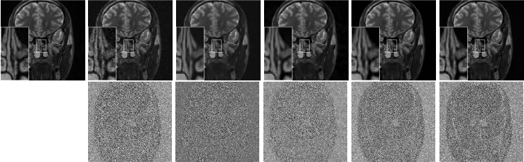

# RicianNet
RicianNet for MRI denoising      

#reader should unzip the file named matconvnet-1.0-beta24.rar  
#your computer should have a successful matcaffe environment

The Code is created based on the method described in the following paper:   
[1] Progressively distribution-based Rician noise removal for magnetic resonance imaging, ISMRM 2018, Oral.     
Authors: Q. Liu, S. Li, J. Lv, D. Liang   
[2] MRI Denoising using Progressively Distribution-based Neural Network, Magnetic Resonance Imaging, 2020.   
Authors: S. Li, J. Zhou, D. Liang, Q. Liu  
Date : 09/2018   
Version : 1.0   

The code and the algorithm are for non-comercial use only.   
Copyright 2018, Department of Electronic Information Engineering, Nanchang University.   

## The flowchart of RicianNet for MRI denoising

The Conv and ReLU layers are denoted as "C"and"R",respectively.The ResNet and ResNet are denoted as "Res" and "ResB",respectively.

## Network architecture of RicianNet

 

## Visual quality comparison on a T1-weighted Brain1 image corrupted with Rician noise level of 5%. 

 
    
From left to right: ground truth image, Rician noisy image and images denoised by NLM, UNLM, BM3D-VST and RicianNet. The corresponding residual images are listed at the second row.

## Other Related Projects
  * Variable augmented neural network for decolorization and multi-exposure fusion [**[Paper]**](https://www.sciencedirect.com/science/article/abs/pii/S1566253517305298)   [**[Code]**](https://github.com/yqx7150/DecolorNet_FusionNet_code)   [**[Slide]**](https://github.com/yqx7150/EDAEPRec/tree/master/Slide)
  
  * IFR-Net: Iterative Feature Refinement Network for Compressed Sensing MRI [**[Paper]**](https://ieeexplore.ieee.org/document/8918016)   [**[Code]**](https://github.com/yqx7150/IFR-Net-Code)
    
  * Iterative scheme-inspired network for impulse noise removal [**[Paper]**](https://link.springer.com/article/10.1007/s10044-018-0762-8)   [**[Code]**](https://github.com/yqx7150/IIN-Code)

  * A Comparative Study of CNN-based Super-resolution Methods in MRI Reconstruction and Its Beyond [**[Paper]**](https://sciencedirect.xilesou.top/science/article/abs/pii/S0923596519302358)   [**[Code]**](https://github.com/yqx7150/DCCN)

  * Complex-valued MRI data from SIAT   [**[Data]**](https://github.com/yqx7150/EDAEPRec/tree/master/test_data_31)
